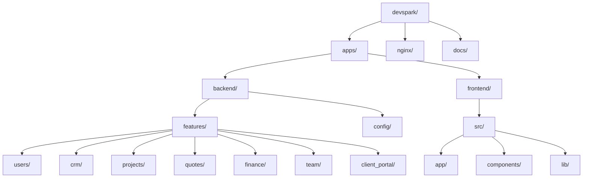

# 01. Project Overview

## What is DevSpark?
DevSpark is a comprehensive enterprise SaaS monorepo designed to manage software development lifecycles, team collaboration, client portals, and financial processes like quoting and invoicing.

## Problem Statement
Development agencies and software teams often juggle multiple disparate tools for CRM, project management, quoting, invoicing, team collaboration, and client communication. This fragmentation leads to siloed data, disjointed workflows, and operational inefficiencies.

## Vision
To provide a unified, premium, single-pane-of-glass platform that integrates the entire agency lifecycle—from initial lead capture (CRM) to quoting, project execution, team management, and final delivery (Client Portal)—under one highly secure, performant, and cohesive architecture.

## Modules
- **Authentication**: JWT-based secure access.
- **CRM**: Lead and company management.
- **Projects**: Task and timelog tracking.
- **Quotes**: Estimates, proposals, and catalogs.
- **Finance**: Invoices, billing milestones, and payment processing (Planned).
- **Team**: Organization structure, worklogs, and leaves management.
- **Analytics**: Dashboard metrics and reporting (Planned).
- **Notifications**: In-app, email, and push notifications.
- **Settings**: System configurations.
- **Client Portal**: External-facing interface for clients to review deliverables.
- **Admin**: Internal Django administration panel.

## Folder Structure

## High Level Workflow
1. **Lead Generation**: CRM captures a new prospect.
2. **Estimation**: Quotes module generates a proposal.
3. **Execution**: Upon approval, a Project is created. Tasks are assigned to the Team.
4. **Collaboration**: Team members log time and collaborate.
5. **Delivery**: The Client Portal is used to share deliverables.
6. **Billing**: Finance issues invoices based on project milestones.

## Architecture Summary
DevSpark operates on a headless architecture. The backend is a robust Python/Django application exposing RESTful APIs via Django Rest Framework (DRF), backed by PostgreSQL for data persistence and Redis/Celery for asynchronous task processing. The frontend is a highly interactive Next.js 16 application using React 19, Tailwind CSS, and Framer Motion for a premium user experience, orchestrating state via React Query and Zustand. All traffic is routed and load-balanced via NGINX in a containerized Docker environment.
