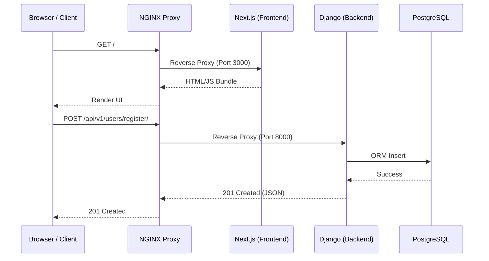
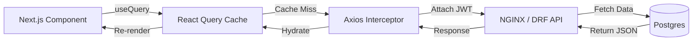

# 02. System Architecture

## Architecture Overview
DevSpark utilizes a decoupled, modern web application architecture consisting of a Next.js React frontend, a Django Python backend, a PostgreSQL relational database, and an NGINX reverse proxy. 

## Component Breakdown

### Frontend
- **Framework**: Next.js 16 (App Router), React 19.
- **State Management**: React Query for server state caching and synchronization.
- **Network Layer**: Axios with custom interceptors for attaching JWTs and handling token refreshes.
- **Styling**: Tailwind CSS for utility-first styling, enhanced with Framer Motion and GSAP for micro-animations.

### Backend
- **Framework**: Django 5 and Django Rest Framework (DRF).
- **Architecture**: Modular application design under `apps/backend/features/*` isolating business logic.
- **Authentication**: `rest_framework_simplejwt` for stateless JSON Web Tokens.
- **RBAC**: Custom permissions and role-based access controls managed at the API view level.

### Database
- **Primary Datastore**: PostgreSQL.
- **ORM**: Django ORM.

### Background Processing
- **Message Broker**: Redis.
- **Worker**: Celery (Used for sending emails and heavy background processing).

### Infrastructure
- **Proxy**: NGINX acts as a reverse proxy, handling rate limiting and security headers, routing `/api/` to the backend and `/` to the frontend.
- **Containerization**: Docker and Docker Compose orchestrate the local and production environments.

## Request Flow

## Data Flow (React Query -> Django)

