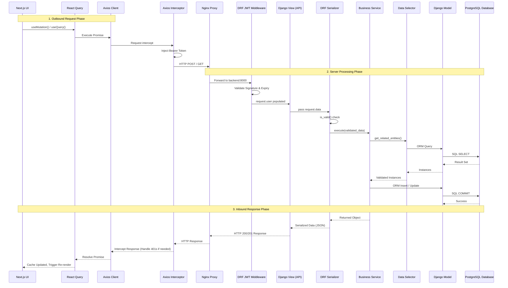

# 04. API Request & Data Flow

This document details the exact sequence of events when a client makes a request to the DevSpark backend.

## Complete Request Lifecycle

## Description of Layers

1. **Next.js UI**: The user interacts with a React component (e.g., clicking "Save").
2. **React Query**: `useMutation` triggers the API call and handles `isPending` state.
3. **Axios & Interceptor**: The request is intercepted locally in `src/lib/api/interceptors.ts` to attach the JWT access token from cookies.
4. **NGINX**: The Docker NGINX service receives the request on port 80/443 and reverse proxies `/api/*` to the Django backend on port 8000.
5. **Django Middleware / JWT**: DRF SimpleJWT validates the token and attaches the `User` object to the `request`.
6. **Django View**: The endpoint receives the request and instantiates a Serializer.
7. **Serializer**: Validates incoming payload shapes, types, and constraints.
8. **Service Layer (`services.py`)**: Responsible for writing data. Implements core business logic (e.g., `RegisterService.execute()`).
9. **Selector Layer**: Responsible for reading data. Keeps the views clean from complex ORM queries.
10. **Model / DB**: Django ORM translates Python objects to raw SQL queries against PostgreSQL.

The response follows the exact reverse path, culminating in React Query updating its cache and the Next.js UI automatically re-rendering to reflect the new state.
