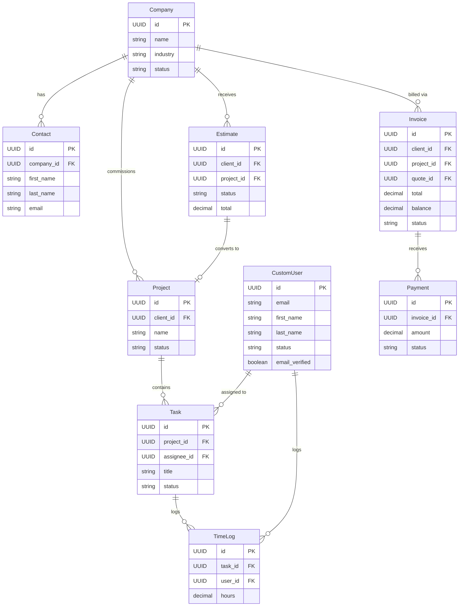

# 02. Database Schema

## Overview
DevSpark uses PostgreSQL as its primary data store. The schema is highly normalized and relies heavily on Foreign Keys and `UUIDField` primary keys.

## Entity Relationship Diagram

## Indexes & Constraints
- `email` fields across the board are unique and indexed.
- Soft deletes are implemented using `is_deleted = models.BooleanField(default=False)`. Most API queries must filter by `is_deleted=False` (often handled automatically via a custom model Manager).
- UUIDs are used for all Primary Keys to prevent URL enumeration attacks.
