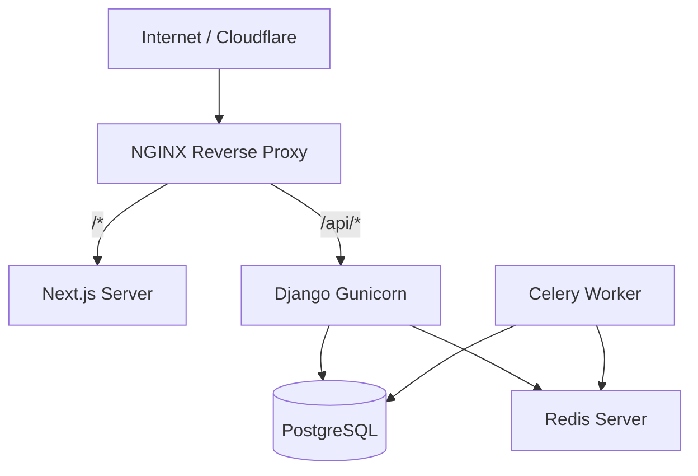

# 02. Deployment Guide

## Production Architecture
DevSpark is deployed using Docker Compose for orchestrating containers. 



## Deployment Environments
- **Vercel**: Can be used for standalone Next.js deployment if detached from the Docker network.
- **Railway / AWS (EC2/ECS)**: Recommended for the backend, Postgres, and Redis containers.

## Docker Deployment Steps
1. Configure `docker-compose.prod.yml`.
2. Supply `.env.prod` containing strict, highly secure secrets (e.g., `SECRET_KEY`, `POSTGRES_PASSWORD`).
3. Build and launch:
   ```bash
   docker-compose -f docker-compose.prod.yml up -d --build
   ```

## NGINX Configuration
The `nginx/nginx.conf` acts as the ingress controller. It routes requests and terminates SSL.
It also enforces caching and compression (gzip/Brotli).

## Health Checks & Monitoring
- **Django Health**: The endpoint `/api/v1/health/` returns `{"status": "ok"}`.
- **Sentry**: Integrated in both Next.js and Django for real-time error tracking and performance monitoring.
- **Logging**: Python's logging module outputs to standard out (captured by Docker logs).

## Backup and Recovery
- Postgres databases are backed up via cron jobs utilizing `pg_dump`.
- Media files should be offloaded to an S3 bucket (configured via `django-storages`) to maintain stateless web containers.
