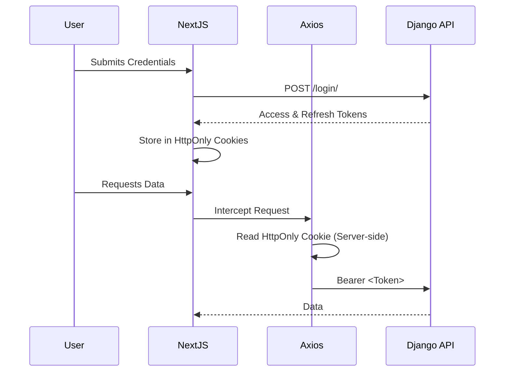

# 03. Security

## Overview
Security is a first-class citizen in the DevSpark monorepo. This document details the protective measures spanning the frontend, API, and network layers.

## Authentication Flow & JWT Lifecycle
1. **Login**: User submits credentials to `/api/v1/users/login/`.
2. **Token Issuance**: The backend issues a short-lived `access` token (e.g., 5 mins) and a long-lived `refresh` token (e.g., 24 hours).
3. **Storage**: Tokens are stored in secure `HttpOnly`, `Secure`, `SameSite=Lax` cookies via Next.js server actions, mitigating XSS attacks that could steal tokens from `localStorage`.
4. **Interceptors**: Axios interceptors automatically attach the token. If an API returns a `401 Unauthorized`, the interceptor automatically attempts to use the refresh token to get a new access token, retries the failed request, and updates the cookie.

## Role-Based Access Control (RBAC)
- All DRF views require authentication by default.
- Custom permission classes (e.g., `IsOrganizationMember`, `IsAdmin`) intercept the request before hitting the view logic.
- **Tenant Isolation**: Users can only read/write data associated with their specific `Organization` or `Company`. 

## CSRF / CORS
- **CORS**: Configured strictly in `django-cors-headers`. Only the explicit frontend origin (e.g., `http://localhost:3000` or production URL) is whitelisted.
- **CSRF**: As we use JWTs (stateless), Django's default CSRF checking for session-based auth is bypassed for the API. However, Next.js implements CSRF tokens for its own server actions.

## Security Headers
`next.config.ts` forces security headers:
- `Content-Security-Policy (CSP)`
- `X-Frame-Options: DENY`
- `X-Content-Type-Options: nosniff`
- `Strict-Transport-Security (HSTS)`

## Rate Limiting
- Applied at the NGINX level (using `limit_req_zone`).
- Django Rest Framework `AnonRateThrottle` and `UserRateThrottle` provide application-layer DDoS protection, specifically targeting heavy endpoints like `/login/`.

## Secure Deployment Practices
- The database is completely firewalled and inaccessible from the public internet. It only accepts connections from the Django and Celery containers.
- Environment variables (`.env.prod`) are injected at runtime via CI/CD pipelines (e.g., GitHub Actions Secrets) and never committed to source control.

## Known Security Limitations
- Refresh token revocation requires a DB-backed blocklist, which adds slight latency to the otherwise stateless JWT process.
- No hardware 2FA / MFA implemented yet. (Marked as Planned).
